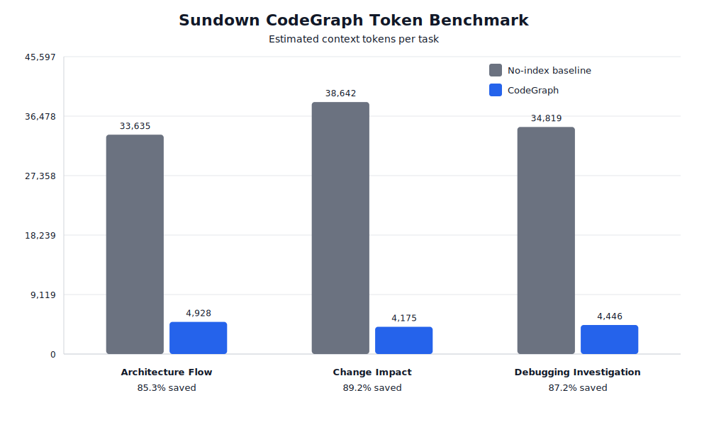
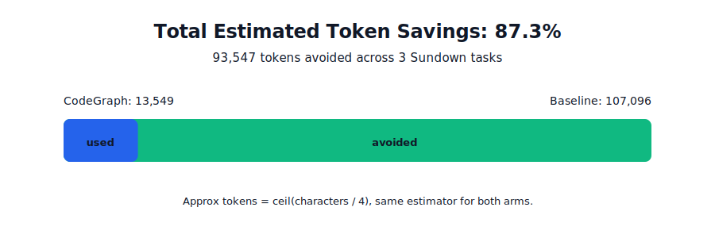

# Sundown CodeGraph Token Savings Benchmark

Methodology: approximate tokens are `ceil(characters / 4)`, applied equally to both arms.
The CodeGraph arm is one `codegraph explore` call per prompt. The no-index baseline is deterministic `rg` output plus full reads of candidate files a careful agent would likely inspect.

| Test | Baseline tokens | CodeGraph tokens | Saved | Saved % | Baseline reads/calls | CodeGraph calls |
|---|---:|---:|---:|---:|---:|---:|
| Architecture Flow | 33,635 | 4,928 | 28,707 | 85.3% | 9 reads + 2 rg | 1 |
| Change Impact | 38,642 | 4,175 | 34,467 | 89.2% | 12 reads + 2 rg | 1 |
| Debugging Investigation | 34,819 | 4,446 | 30,373 | 87.2% | 10 reads + 2 rg | 1 |
| **Total** | **107,096** | **13,549** | **93,547** | **87.3%** |  |  |

Caveat: this measures context volume, not provider billing logs. A live agent run can vary based on model behavior, retries, and whether it follows the CodeGraph hint promptly.